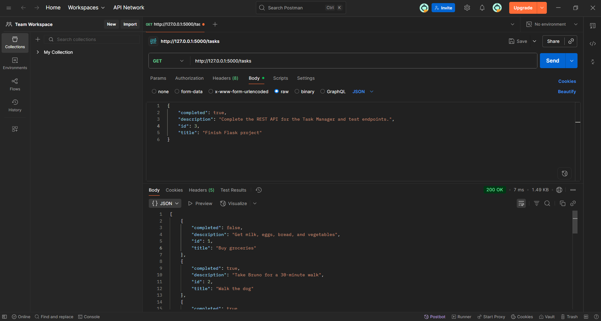

# Task Manager API

## Overview

**Task Manager API** is a modular RESTful API built with Flask that allows users to manage tasks in a simple and efficient way. It supports full **CRUD operations** (Create, Read, Update, Delete) with tasks having a **title, description, and completed status**.
This project demonstrates a clean, scalable Flask structure suitable for learning, testing, and small projects.

Checkout the docker built image : [Docker link](https://hub.docker.com/repository/docker/keneandita/taskmanagerapi/general)

### Author : [Kenean Dita](https://github.com/KeneanDita)

## Features

* Create, read, update, and delete tasks.
* Task fields: `title`, `description`, `completed`.
* JSON-based REST API responses.
* Modular Flask structure for scalability.
* Easy database population for demo/testing.

## Tech Stack

* **Backend:** Python, Flask, Flask-SQLAlchemy
* **Database:** SQLite
* **Testing:** Postman / cURL
* **Extras:** Flask Blueprints for modular structure

## Project Structure

```PS
task_manager_api/
│── app.py                 # Entry point of the app
│── requirements.txt       # Python dependencies
│── populate.py            # Script for demo population
│── Dockerfile             # For Deployment Services
│── README.md
│
├── instance/
│   ├── tasks.db
│   └── config.py          # Configuration settings (DB URI, debug)
│
└── app/
    ├── __init__.py        # App factory & blueprint registration
    ├── models.py          # Task model
    ├── routes.py          # API endpoints (tasks + homepage)
    └── utils.py           # Optional helper functions
```

## Installation & Setup

### Clone the repository

```bash
git clone https://github.com/KeneanDita/Task-manager-API
cd Task-manager-API
```

### Create a virtual environment

```bash
python -m venv venv
source venv/bin/activate        # Linux/macOS
venv\Scripts\activate           # Windows
```

### Install dependencies

```bash
pip install -r requirements.txt
```

### Run the Application

```bash
python app.py
```

* Flask will run at: `http://127.0.0.1:5000/`
* Homepage: `http://127.0.0.1:5000/`
* Tasks API: `http://127.0.0.1:5000/tasks/`

## API Endpoints

| Method | Endpoint      | Description             |
| ------ | ------------- | ----------------------- |
| GET    | `/`           | Homepage info           |
| GET    | `/tasks/`     | Get all tasks           |
| GET    | `/tasks/<id>` | Get a task by ID        |
| POST   | `/tasks/`     | Create a new task       |
| PUT    | `/tasks/<id>` | Update an existing task |
| DELETE | `/tasks/<id>` | Delete a task           |

**Example POST body:**

```json
{
  "title": "Buy groceries",
  "description": "Get milk, eggs, bread, and vegetables",
  "completed": false
}
```

**Example GET body:**

```json
{
    "completed": false,
    "description": "Read at least 50 pages of 'Clean Code'",
    "id": 4,
    "title": "Read a book"
}
```



### Populate Database (Demo) Using Python script

I have created `populate.py` with task data (10 tasks with title, description, completed). You can change it it's just better than manually entering tasks 1 by 1 just to check.

Run this command to populate the Database:

```bash
python populate.py
```

### Additional Notes

* **Database:** SQLite (`tasks.db`) is created automatically when the app runs.
* **Scalability:** Modular structure makes it easy to add users, authentication, or new resources.
* **Testing:** Recommended to use Postman or cURL to interact with the API.
* **Extensibility:** Easily extend endpoints for pagination, filtering, or search.

### License

This project is **free for everyone** yes, really!  
Use it, learn from it, tweak it, or just stare at it in admiration.

No strings attached, no secret handshake required.
If you break it… hey, you only have yourself to blame.
Share it, fork it, remix it just have fun with it!
